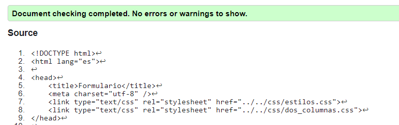

Practica02-Mi-Sitio-Web-CSS
===========================

Comenzamos creando el index.html con la cual vamos a utilizar el modelo de 2
columnas en CSS, con esto se puede realizar las pruebas adecuadas para así
posteriormente acoplar a las demás páginas.

Al momento de generar los archivos html usaremos selectores e ID para de esta
manera identificar el o los elementos que deseamos agregar cierto estilo o
modificación por medio de CSS. Dentro de HTML también usaremos la etiqueta
“\<div\>” para que con esto nos permita tratar a los elementos como objetos
diferentes dentro del body.

**\
**

Con eso agregamos los los estilos de CSS (aunque todavía no presente código)
para de esta manera ir modificando el estilo de cada uno de estos.

**\<link type="text/css" rel="stylesheet" href="css/estilos.css"\>**

**\<link type="text/css" rel="stylesheet" href="css/dos_columnas.css"\>**

Dentro de estilos.css seleccionamos el color de fondo y también la dimensión de
HTML, este caso usaremos para ancho “width: 100vw”, altura “heigh: 100vh”. Estas
unidades de vw y vh son “viewport” y estas son medidas relativas con lo cual se
podría visualizar en diferentes resoluciones tales como de un dispositivo
celular hasta un monitor de alta resolución.

Como se puede apreciar en las imágenes en el primero esta maximizado mientas que
el segundo caso se minimiza a su mínima dimensión.

De igual manera como se solicita la las etiquetas h1,h2,h3 presentan un diseño
diferente*:*

**h1 {**

**font-size: 1.5em;**

**text-align: center;**

**text-decoration: underline overline;**

**}**

**h2 {**

**font-size: 1.5em;**

**color: rgb(91, 183, 219);**

**text-align: center;**

**}**

**h3 {**

**font-size: 1em;**

**color: black;**

**}**

La navegación de igual manera que se pide presenta bordes redondeados en este
caso con un valor de 25px.

La ventana de formulario presenta un cambo para el nombre, email y mensaje cada
uno de estos presenta una etiqueta para que su dimensión del área de texto sea
la misma en el ancho, también se le asigna el espacio de las “cajas” de nombre
email y mensaje.

HTML

**\<div id="formu"\>**

**            \<section\>**

**                \<div\>**

**                    \<label for="name"\>Nombre:\</label\>**

**                    \<input type="text" id="name" /\>**

**                \</div\>**

**                \<div\>**

**                    \<label for="mail"\>E-mail:\</label\>**

**                    \<input type="email" id="mail" /\>**

**                \</div\>**

**                \<div\>**

**                    \<label for="msg"\>Mensaje:\</label\>**

**                    \<textarea id="msg"\>\</textarea\>**

**                \</div\>**

**                \<div class="button"\>**

**                    \<button type="submit"\>Enviar mensaje\</button\>**

**                \</div\>**

**            \</section\>**

**        \</div\>**

CSS

**label {**

**  display: inline-block;**

**  width: 90px;**

**  text-align: right;**

**}**

**input,**

**textarea {**

**  width: 300px;**

**  box-sizing: border-box;**

**}**

**textarea {**

**  vertical-align: top;**

**  height: 5em;**

**  resize: vertical;**

**}**

**.button {**

**  padding-left: 175px;**

**}**

**La evidencia del correcto diseño de las páginas HTML usando CSS. Para lo cual,
se puede generar fotografías instantáneas (pantallazos).**

Estilo de 3 columnas de una página.

**La evidencia de la validación de cada página HTML.**

**La evidencia de la validación de las hojas de estilos CSS.**

**En el informe se debe incluir la información de GitHub (usuario y URL del
repositorio de la práctica)**

Usuario: wbarbecho

Link: <https://github.com/wbarbecho/Practica02-Mi-Sitio-Web-CSS>

**Tutorial**

Usuario: wbarbecho

Link: <https://github.com/wbarbecho/Tutorial-02---1TriAndSuccedSports>
